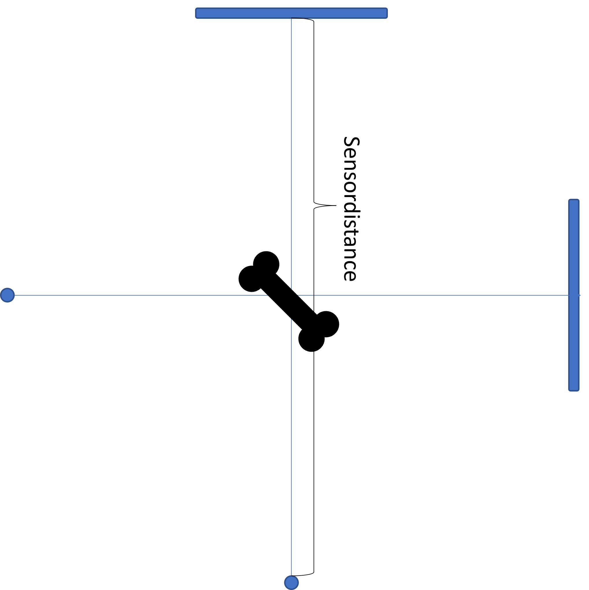

# Contour fitting

Our next task is to estimate the 3D shape of a vertebra from an X-Ray image. 
We will consider here a simplified setting. We assume that a user manually annotates
the shape's contour on the x-ray image. This can be done in practice with only a few seconds of effort from the user. The fitting task, however, becomes almost trivial. 

## Problem setup

As always we approach the problem using analysis-by-synthesis. This means, 
we need to be able to synthesize the contours from the model. 
The setup is illustrated in Figure 1. 

We assume a fixed setup, where the object will be located at the coordinate origin, 
and two sources, with corresponding detector planes, are located each at a fixed distance apart.  

The code for projecting an object to the XY and XZ plane according to above setup can be found in [XRay.scala](https://github.com/shape-the-world/vertebra-case-study/blob/main/src/main/scala/rendering/XRay.scala).

## Contour fitting using Metropolis-Hastings sampling

Given the possibility to render contours from a given 3D vertebra shape, we can perform model fitting using sampling methods. The idea is simple: Given two annotated contours $C_{xy}, C_{xz}$ obtained from X-Ray images for the corresponding planes, we can sample
shapes from our shape model, project them and quantify how likely it is that the observed contours $C_{xy}, C_{xz}$ were generated from the sampled contours. 

Mathematically, this can be formalized as follows:
Let $\theta = (\alpha, r_\phi, r_\psi, r_\theta, t_x, t_y, t_z)$ denote a parameter vector consisting of the shape model coefficients $\alpha$, rotation angles $r_\phi$, $r_\psi$ and $r_\theta$ and translation parameters $t_x, t_y, t_z$. Any given assignment
of parameters $\theta$ leads to a given surface, which we denote $\Gamma(\theta)$. 
Defining appropriate prior distributions over the shape parameters $\theta$ as well as over the parameters for the rotation and translation the object can undergo, allows us to formulate the problem again as a problem in Bayesian inference. 
$$
p(\theta | C_{xy}, C_{xz}) = \frac{p(C_{xy}, C_{xz} | \theta)p(\theta)}{\int_\theta p(C_{xy}, C_{xz} | \theta) p(\theta) \, d\theta}
$$

The code implementing an appropriate sampler is organized in the package [fitting.contour](https://github.com/shape-the-world/vertebra-case-study/tree/main/src/main/scala/fitting/contour). As we have already seen in the registration step, it is usally better to consider a stepwise approach, where in a first step only the rough shape is recovered and details are fitted in a later stage. The implementation follows this strategy and fits in a first stage only the pose, in a second stage a reduced rank model and in the final stage the full model. 

### Results

The result of this step is a set of samples (i.e. parameters $\theta_1, \ldots, \theta_n$, defining corresponding 3D surfaces $\Gamma(\theta_1), \ldots, \Gamma(\theta_n)$) following the posterior distribution defined above. If the shape is well constrained by the two given contours, we expect this posterior distribution to be rather narrow. In this case we can select single sample, usually the one with the highest probability under the posteiror distribution, as a representative shape for the subsequent steps. 
In case the samples show a lot of variance, we might want to constrain the 3D shape further by adding more contours as observations in our fitting process. 

TODO add results from experiments

### Calibration

In a practical setting where we only get an X-ray image, we usually do not know the exact setup with which the image was acquired. In particular, the sensor distance is not known, which, as a consequence, would leave the size of the object unconstrained. We propose to add a calibration object (such as for example sphere of known size) to the image, which can easily be segmented. Measuring the size of this object in the image allows us to compute the sensor distance, and hence to fix the scale
of the 3D reconstruction. 