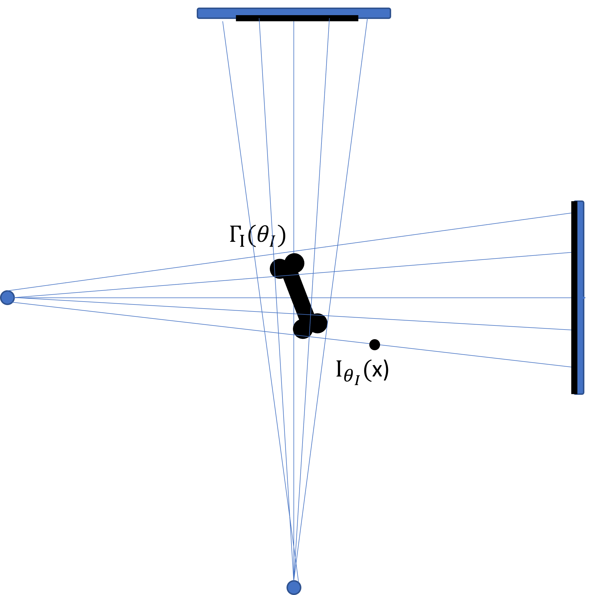

# Intensity fitting

In the previous step of this case study we performed a contour fitting to retrieve a
3D reconstruction of the shape of the vertebra. In this step we consider this shape as 
fixed and estimate the intensity distribution on this 3D shape from the X-Ray images. 
This is done by performing an intensity model fitting, using again a Metropolis-Hastings sampling. Indeed, this part of the case study closely matches the 
setup of the contour fitting step. The only difference is that the parameters we sample describe the intensity distribution and not the shape. 

## Problem setup

The first step in the problem setup is again to build a generative model of the data.
We use for this step the intensity model, i.e. the tetrahedral representation of the shape, on which we have defined the intensity distributions. We denote the intensity model defined for a given shape $\Gamma$ as
$\Gamma_I[\theta_I]$, where the coefficients $\theta_I$ are the parameters governing the intensities. Given a suitable interpolation strategy, we can view the intensity model as a function $I_{\theta_I} : \mathbb{R}^3 \to \mathbb{R}$ defined as 
$$
I_{\theta_I}(x) = \left \{ \begin{array}{ll} \Gamma_I[\theta_I](x) & \text{if } x \in \Gamma \\ 0 & \text{otherwise} \end{array} \right.
$$

To generate an intensity $DRR(p)$ at a point $p$ in the DRR image, we integrate the intensity values $I(_{\theta_I}$ on the line $L$ from the sensor source $s$ to the point $p$:
$$
DRR(\theta_I)(p) = \int_{L} I_(\theta_I)(x) \, dx
$$

This setup is implemented in [DRRRenderer.scala](https://github.com/shape-the-world/vertebra-case-study/blob/main/src/main/scala/rendering/DRRRenderer.scala)

## Intensity Fitting using Metropolis-Hastings sampling

Given this DRR-Simulation, we can  define a likelihood, that defines how likely 
it is that two observe X-Ray image $X$ was generated from the DRR image:
$$
p(X | \theta_I) = \prod_{p \in \Gamma} N(DRR(\theta_i), \sigma^2)
$$ 
with some noise term $\sigma^2$ defined on the intensities. 

The intensity model defines a prior distribution $\theta_I \sim N(0, I)$ on the parameters $\theta_I$, which completes the Bayesian model. 

We use again Metropolis-Hastings Sampling to obtain samples from the posterior distribution given two X-ray images $X_{XZ}$ and $X_{XY}$
$$
p(\theta_I | X_{XZ}, X_{XY}) = \frac{p(\theta_I) p(X_{XZ} | \theta_I) p(X_{XY} |\theta_I)}{\int p(\theta_I) p(X_{XZ} | \theta_I) p(X_{XY} |\theta_I) \, d\theta_I}
$$
where we assumed independence of the two generated views. 

The corresponding Metropolis-Hastings sampler is implemented in the package
[fitting.instensity](https://github.com/shape-the-world/vertebra-case-study/tree/main/src/main/scala/fitting/intensity).

#### Result

TODO add results from the experiments

#### Limitations and possible improvements
One possible limitation of this simple approach is, that sampling can be very slow. 
The reason is that the generation of the DRR image is computationally intensive. 
Given the strongly non-linear nature of the problem, many samples would need to be generated to obtain an accurate solutions. 

In pratice, we therefore restrict the parameter space to the first few parameters of the intensity distribution, which can be estimated within a reasonable time frame. 
This should, however, not be a serious impediment, because the first few principal components usually capture a large amount of the important intensity differences. 

## Calibration

It is well known that different X-Ray machines can exhibit differences in the way the different tissue types are mapped to Hounsfield units. In order to be able to 
obtain realiable BMD measurements, it may therefore be important to add a calibration phantom when acquiring the images. This makes it possible to correct these differences and
obtain a 3D intensity distribution which really reflects the actual tissue types. 

