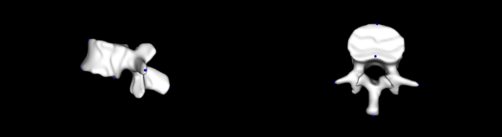

# Building the statistical shape model

## Data screening 

The statistical model of the lumbar spine was developed from the [VerSe’20](https://github.com/anjany/verse) public dataset. The dataset consists of data from multiple multi-detector CT scanners and includes a range of field-of-view and scan settings. The data incudes ground-truth segmentation masks and vertebral centroid annotations. The VerSe’20 dataset contained instances of vertebral fractures, foreign material and metal implants, therefore, the images were screened and only individuals with complete lumbar spine (L1-L5) and no bone pathologies or obstructions were used to construct the model. Currently, the model is constructed from 18 subjects from the VerSe’20 training set.  
Using the segmentation masks, the surface meshes of each lumbar level were extracted from the corresponding CT images. The model for each lumbar level, across the dataset, was constructed independently. The same method is used for all the lumber spines.

## Initial reference selection

A reference mesh was randomly selected from the 18 L1 surface meshes, and seven landmarks were manually identified on its surface using Scalismo graphic user interface (GUI). Four landmarks were identified on the vertebral body: anterior and posterior points on the superior and inferior planes of the vertebral body. Two landmarks were identified on the transverse processes, one on each side, and the final landmark on the spinous process (Fig. 1). 



In addition to the surface mesh, the tetrahedral mesh was required for the model building process and a tetrahedral mesh of the reference was constructed using Amira software v6.2.0 (http://www.fei.com/).


## Alignement
To establish dense correspondence among the L1 vertebra in the dataset, the first step is to perform a rigid alignment, in order for all the datasets to be in the same coordinate system. The reference landmarks were used to rigidly align the 17 L1 extracted surfaces to the reference surface. The rigid alignment removes any rotation and translation differences between the data. As a result, the only differences that will be modeled are shape and intensity differences. Similar landmarks as those annotated on the reference and in the same order were manually annotated on the rest of the dataset. 
Each target surface was aligned to the reference surface by finding the best rigid transformation from the set of landmarks. The best transformation was found by minimizing the mean square error between corresponding landmark points.  T

The code for aligning the data can be found in the class [AlignData.scala](https://github.com/shape-the-world/vertebra-case-study/blob/main/src/main/scala/pipeline/AlignData.scala).  The code is typical for any tool in our pipeline. The main function prepares the data repository and runs through all the datasets that it finds for the given Vertebra. 
Each case is processed in a helper functon ```processCase```. Note that in case computation fails for a dataset, an error is logged and the computation continues with the next dataset. Another point to note is the use of the different stages. The data is loaded  by specifying the ```caseId``` and in which stage it is in. The input data is 
in the stage ```Initial```. After processing, the data is written using the stage ```Aligned```. 

##### Defining the landmarks
A landmark tool was used to ensure the sequence of landmarking was maintained across the dataset with the reference being used as the guide. 

* TODO: Add landmark tool to pipeline code and refer to it from here. 


## Establishing Correspondence

Dense correspondence is essential when constructing statistical models. Correspondence between two objects means finding a one-to-one mapping between surface points which define the object as well as intensity values inside the objects. This means that all objects have the same number of points and points with the same identifier on the surface represent the same point/region on another surface.

### Building a Prior Model for registration
With only one example shape, a point distribution model (PDM) cannot be constructed as it is based on shape deformations being learnt from example shapes. A prior model was, therefore, build analytically using a [Gaussian Process Morphable Model](https://ieeexplore.ieee.org/iel7/34/4359286/08010438.pdf). 


The code for building the model is given in [BuildGPModel.scala](https://github.com/shape-the-world/vertebra-case-study/blob/main/src/main/scala/modelling/BuildGPModel.scala)

We see that deformations 
are modeled on differnt scales, in order to capture both large global shape differences, as well as differences in local details. We also notice that we build the model using a reference that is a tetrahedral mesh. From this we extract the model for the outer mesh. Both models share the same principal components. 


### Registration

Registration is done by using the previously built Gaussian process model as a prior, and a given surface distance as a likelihood. More precisely, let $\Gamma(\theta)$ denote the surface corresponding to the model coefficients $\theta$. Registration is 
done by solving the following MAP problem
$$
\arg \max_\theta p(\theta | \Gamma_T, \Gamma_R) = \arg \max_\theta p(\theta)p(\Gamma_T | \theta, \Gamma_R)
$$
where $p(\theta) \in N(0, I)$ is a prior on the model coefficients and the likelihood is $p(\Gamma_T | \theta, \Gamma_R) = \frac{1}{Z}\exp{-\lambda^{-1} M[\Gamma[\theta], \Gamma_T]}$. Here $\Gamma[\theta]$ denotes the surface corresponding to the shape coefficients $\theta$ and $M$ is a distance metric. 

Looking at the code, given in [NonrigidRegistration.scala](https://github.com/shape-the-world/vertebra-case-study/blob/main/src/main/scala/pipeline/NonrigidRegistration.scala) we notice that the above optimization is not formulated in terms of the probabilistic problem, but as the equivalent energy minimization problem
$$
\arg \min_\theta M[\Gamma[\theta], \Gamma_T] + \lambda ||\theta||^2.
$$
The first term corresponds to the log likelihood and the regularization term is derived from the (log of the) prior. We notice that this optimization is not only done once, 
but performed several times sequentally with decreasing regularization parameter $\lambda$. This has the effect that in the earlier steps the shape differences are 
mainly explained using the leading shape coefficients, whereas in later steps, the flexibility is added to also explain more detailed deformation. 


### Building the PCA Model

After all the surfaces were brought into correspondence, the shape model is built ([BuildSSM.scala](https://github.com/shape-the-world/vertebra-case-study/blob/main/src/main/scala/modelling/BuildSSM.scala)).  To decreaseThe mean of the SSM is saved and used as the new reference surface used for registration.Thereafter an SSM was built, and the mean used to update the reference surface. This step was repeated until there was no change in the mean surface distance between the reference meshes. This removed the bias due to picking one of the example shapes as the reference. 
Once a stable reference surface has been obtained and the dataset is aligned and registered. After registration, each inverse of the rigid transformation was used to retrieve the entire dataset to its original spatial position of the surfaces. 

The correspondence across volumetric shape-intensity of the L1 was obtained by aligning each tetrahedral mesh to its corresponding CT image, and the voxel intensity value of the closest voxel to a mesh vertex was assigned to that vertex. Once intensity values were assigned to the mesh pints for each volumetric mesh, correspondence was created across volumetric shape-intensity. These volumetric shape-intensity of the L1 was then used to create a deformable shape and intensity model of the L1.


