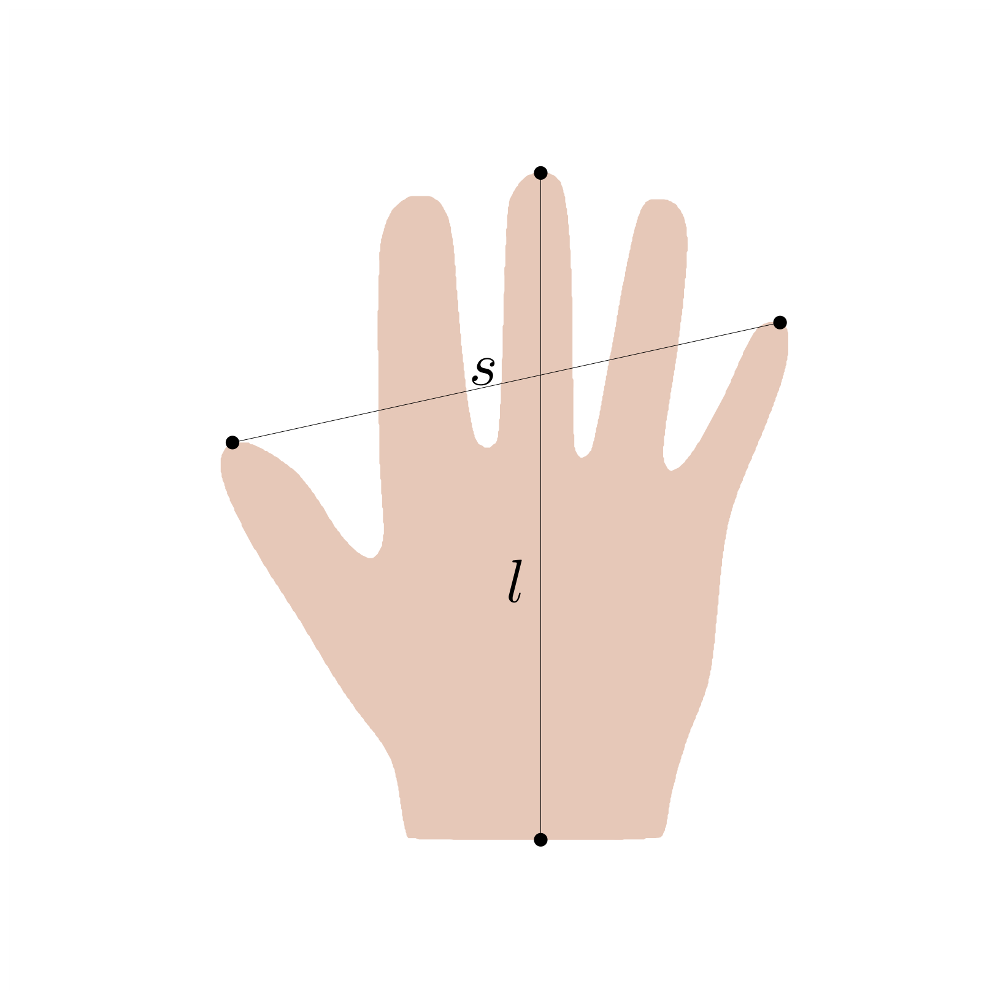
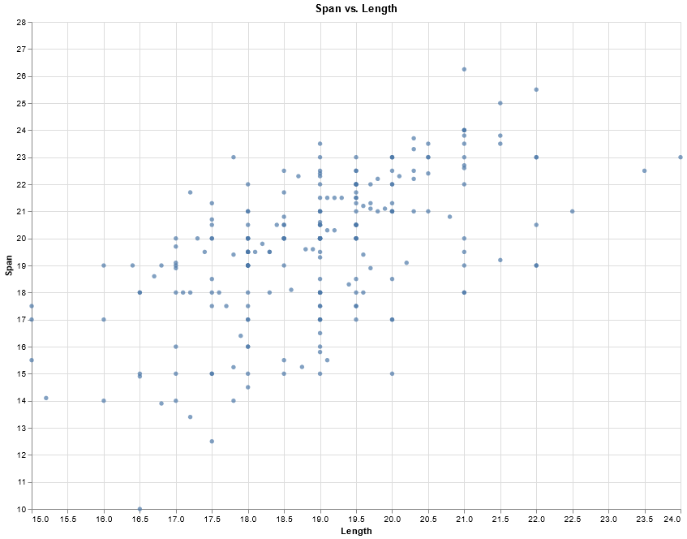
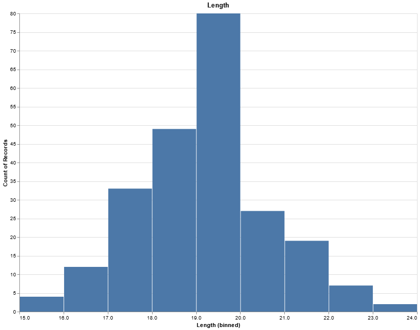
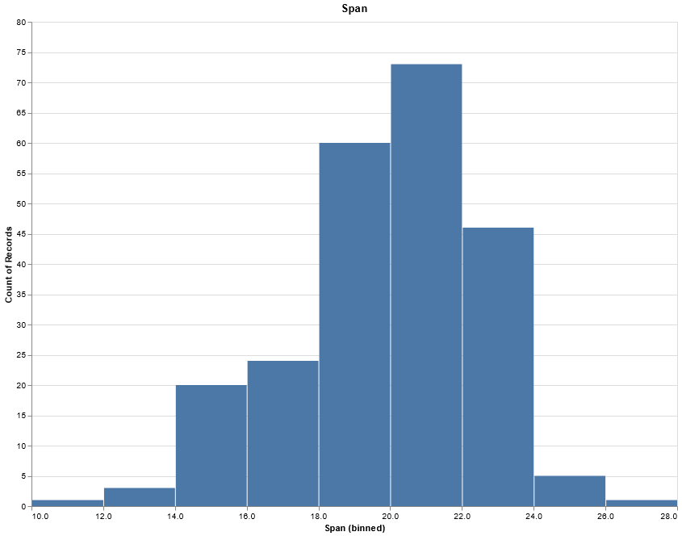

# A toy problem: Inference on hand shapes

Before we approach the real problem of 3D reconstruction of vertebra shapes from 2D contours, 
we introduce all the relevant techniques on a toy problem. This will allow us to experiment with and understand the main concepts on a simple task, which can be easily understood, visualized and debugged. 
The task is also simple from a mathematical point of view: We will work on a simple linear regression model with one dependent variable. While this may sound overly simplistic, it turns out that our final application will have exactly the same structure. 

### The simplest shape model of a hand

Our toy problem is the simplest example of a shape model. A very rough approximation of a hand shape 
can be obtained from only two measurements: The length $l$ of the hand and the span $s$ of the hand 
(see Figure 1). 

||
|:--:| 
|<b> Figure 1: A simple shape model from length and span</b>|

Although this does not capure details in shape variation, it is sufficient to roughly characterize the shapes. 

We have measured the length and the span on 233 individuals. The following scatterplot shows these measurements. We see that there is clearly a correlation between length and span. 

||
|:--:| 
|<b> Figure 1: Measuremnts</b>|

A histogram of length and span shows an approximation of the distribution of the marginals $s$ and $l$. 

||  |
|:::|:::|
|<b> Figure 2: The marginal distribution of length and span</b> ||

### Task and goals

In this project we will run through a typical inference task on this data replicating the steps of the Bayesian workflow. In a first step we model a prior for the length and perform prior-predictive step. We then 
extend this simple model to a regression model, where the length is the predictor for the span. Also in this step we perform prior predictive checks to assess the implications of our prior assumptions. 
In the next step we fit the model to given data, first using fake-date simulation and in a later step using the real data. We then perform posterior-predictive checks and evaluate our model. 

